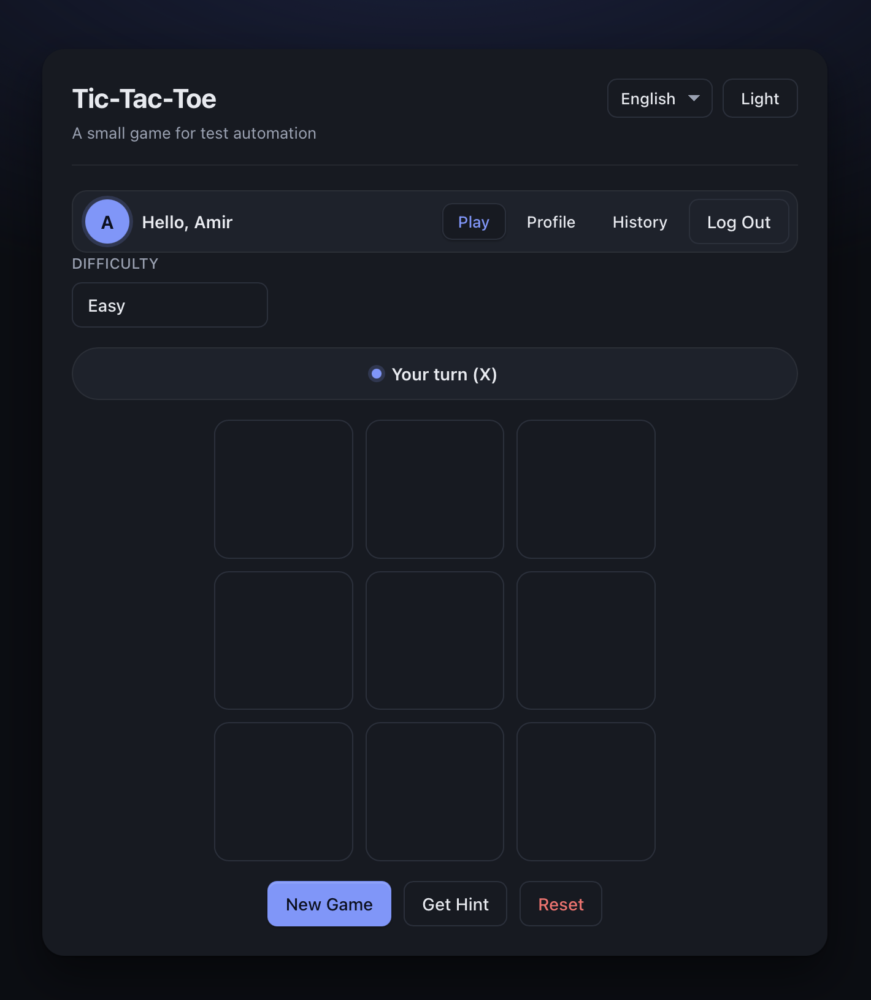

# Tic-Tac-Toe Playwright Automation

[](https://www.python.org/)
[](https://playwright.dev/python/)
[](https://docs.astral.sh/ruff/)
[](pyproject.toml)

Python Playwright automation for a static Tic-Tac-Toe web application. The project captures the take-home test plan, test cases, page-object models, and executable browser tests needed to validate account, gameplay, profile, history, and account termination flows.

## Table of Contents

- [Visuals](#visuals)
- [Quick Start](#quick-start)
- [Configuration](#configuration)
- [Usage](#usage)
- [Project Structure](#project-structure)
- [Technologies](#technologies)
- [Contributing](#contributing)
- [Code of Conduct](#code-of-conduct)

## Visuals



Additional screenshots:

- [Account creation](docs/media_attachment/first-page-account-creation.png)
- [Login](docs/media_attachment/first-page-log-in.png)
- [Profile](docs/media_attachment/user-profile-page-with-states.png)
- [History](docs/media_attachment/user-history-page-game-records.png)

## Quick Start

### Option 1: uv

```bash
git clone <repository-url>
cd sample-take-home-automation-task
cp .env.example .env
uv sync
uv run playwright install chromium
uv run pytest --browser chromium
```

### Option 2: pip

```bash
git clone <repository-url>
cd sample-take-home-automation-task
python3.14 -m venv .venv
source .venv/bin/activate
python -m pip install --upgrade pip
python -m pip install -r requirements.txt
python -m playwright install chromium
cp .env.example .env
pytest --browser chromium
```

## Configuration

Tests read runtime configuration from `.env`. Start from `.env.example`:

```dotenv
APP_HOST=127.0.0.1
APP_PORT=0
APP_ROOT=.
APP_ENTRYPOINT=index.html
```

- `APP_PORT=0` lets the test server choose an available local port.
- `APP_ROOT` and `APP_ENTRYPOINT` point the static server at the application under test.
- `.env` is ignored by Git; update `.env.example` when configuration keys change.

## Usage

Run the default browser test suite:

```bash
uv run pytest --browser chromium
```

Watch tests run in a visible browser:

```bash
uv run pytest --browser chromium --headed
```

Run another supported browser:

```bash
uv run playwright install firefox webkit
uv run pytest --browser firefox
uv run pytest --browser webkit
```

Serve the application manually for exploratory testing:

```bash
uv run python tests/server_test.py
```

Check formatting and linting:

```bash
uv run ruff format --check .
uv run ruff check .
```

Playwright tracing, screenshots, and videos are configured in `pyproject.toml` and retained on test failures.

## Project Structure

```text
.
├── index.html        # Static Tic-Tac-Toe app under test
├── src/pages/        # Playwright page-object models
├── src/utils/        # Local static app server helpers
├── tests/            # Pytest suites grouped by test scenario
├── docs/             # Original instructions, test plan, and test cases
└── docs/media_attachment/
    └── *.png, *.mov  # Screenshots and recordings used by the documentation
```

## Technologies

- Python 3.14+
- Playwright for Python
- pytest and pytest-playwright
- python-dotenv
- Ruff
- HTML, CSS, and JavaScript for the static app under test

## Contributing

1. Create a focused branch for your change.
2. Keep page-object updates close to the flow they support.
3. Add or update tests for changed behavior.
4. Update `docs/TESTPLAN.md`, `docs/TESTCASE.md`, or screenshots when user-facing flows change.
5. Run the relevant checks before opening a pull request:

```bash
uv run ruff format --check .
uv run ruff check .
uv run pytest --browser chromium
```

## Code of Conduct

Keep communication respectful, constructive, and focused on the work. Harassment, discriminatory language, and personal attacks are not acceptable; maintainers may remove comments or contributions that violate these expectations.
